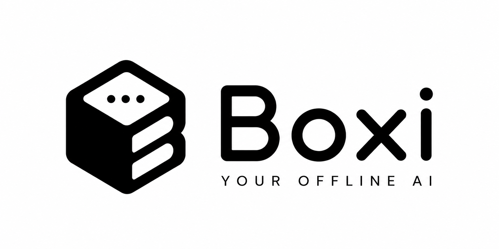
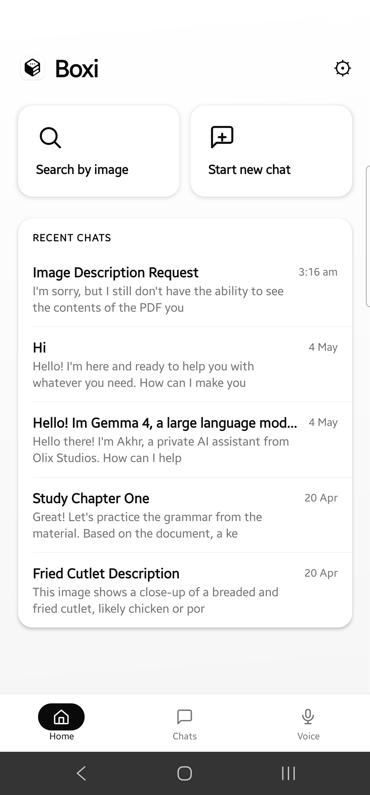
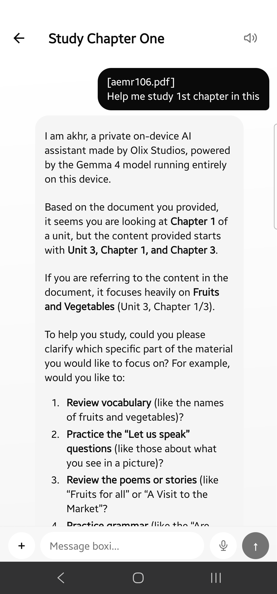
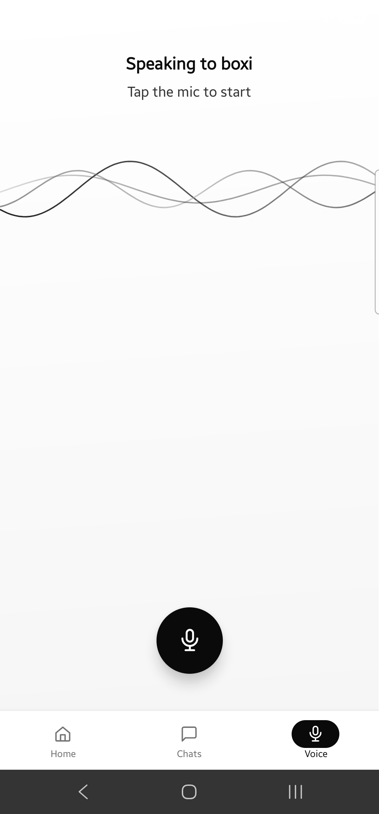
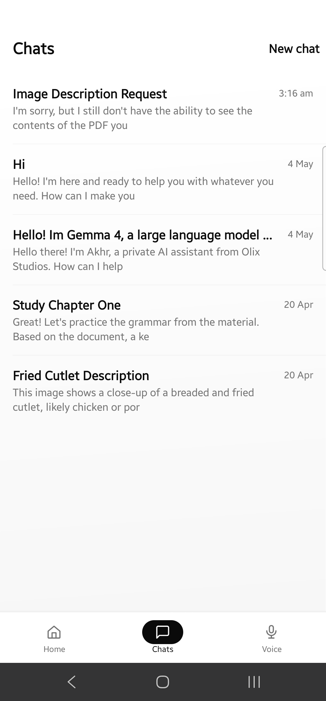

<div align="center">

<br />



<br />
<br />

### AI that can't leak your data — because it never leaves your phone.

Boxi is a fully offline AI assistant for Android. No servers. No subscriptions. No data collection.

<br />

[](https://github.com/OlixIgnacious/boxi-ai/releases/latest)&nbsp;
[](.)&nbsp;
[](.)&nbsp;
[](LICENSE)

<br />

</div>

---

<p align="center">
  &nbsp;&nbsp;
  &nbsp;&nbsp;
  &nbsp;&nbsp;
  
</p>

---

**🔒 Zero data collection** — Conversations are stored in a local SQLite database and never transmitted anywhere. No account required.

**⚡ Works offline forever** — Download the model once (~2.5 GB) on first launch. After that, no internet ever needed.

**🎙 Voice mode** — Tap the mic, speak naturally. Boxi transcribes on-device, generates a response, and speaks it back using Kokoro neural TTS.

**📄 Document Q&A** — Attach a PDF or text file and ask questions about it. Everything processed locally.

**🖼 Vision** — Send a photo and ask about it. Gemma 4 multimodal model, entirely on-device.

**💬 Multi-turn chat** — Full conversation history with AI-generated titles and streaming token rendering.

---

## How the voice pipeline works

```
You speak  →  Android SpeechRecognizer (on-device)
           →  Gemma 4 via LiteRT (streams tokens)
           →  Kokoro TTS pre-synthesises next chunk while current plays
           →  You hear a response in seconds
```

---

## Tech stack

**Frontend** — React Native 0.85 · React Navigation 7 · react-native-svg · op-sqlite · rn-fetch-blob

**Native (Kotlin)** — Google AI Edge LiteRT 0.10 · Sherpa-ONNX 1.12.39 · Android SpeechRecognizer · Apache Commons Compress

**Models**

| | |
|---|---|
| LLM | Gemma 4 E4B Instruct — `.litertlm`, ~2.5 GB |
| Voice | Kokoro EN v0.19 via Sherpa-ONNX — ~80 MB |

---

## Device requirements

| | |
|---|---|
| Android | 7.0+ (API 24) |
| RAM | 6 GB minimum |
| Storage | 3 GB free |
| Architecture | arm64-v8a |

---

## Build

```sh
npm install

npx react-native bundle \
  --platform android --dev false \
  --entry-file index.js \
  --bundle-output android/app/src/main/assets/index.android.bundle \
  --assets-dest android/app/src/main/res

# Debug
cd android && ./gradlew assembleDevDebug

# Production
cd android && ./gradlew bundleProdRelease
```

**Flavors:** `dev` → `com.olix.dev` · `qa` → `com.olix.qa` · `prod` → `com.olix`

---

## Privacy

Boxi collects nothing. No analytics, no telemetry, no crash reporting. The only network call ever made is the one-time model download on first launch. After that, fully air-gapped.

---

<div align="center">

Made by [Olix Studios](https://github.com/OlixIgnacious)

</div>
